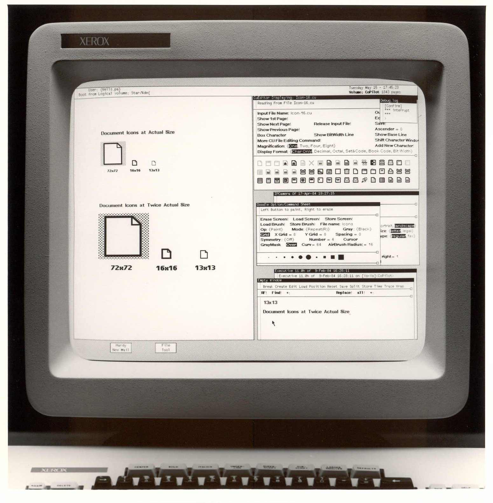

# 🖥️ 1981 – Xerox Star und die Entstehung des modernen User Interface

> „The best way to predict the future is to invent it.“  
> — Alan Kay, Xerox PARC

---

## 🧠 Hintergrund

Im Jahr **1981** stellte **Xerox** mit dem **Xerox Star 8010** das erste Computersystem vor,  
das das heute selbstverständliche **Desktop-Paradigma** einführte.  
Ordner, Dateien, Papierkörbe und Icons bildeten die Grundlage eines visuellen Arbeitsumfelds –  
eine Revolution in der Interaktion zwischen Mensch und Maschine.

Während **Apple (Lisa, Macintosh)** und **Microsoft (Windows)** diese Ideen später populär machten,  
war der **Xerox Star** der wahre Pionier:  
Er verband Software erstmals systematisch mit Prinzipien der **menschlichen Wahrnehmung**  
und legte damit den Grundstein für die moderne **Human-Computer-Interaction (HCI)**.

---

> Xerox Star 8010 Interface

---

## ⚙️ Technische Innovation

| Konzept                        | Bedeutung                                                                 |
| ------------------------------ | -------------------------------------------------------------------------- |
| **Graphical User Interface**   | Ersetzte textbasierte Befehle durch visuelle Symbole und Fenster           |
| **Desktop-Paradigma**          | Virtueller Schreibtisch mit Dokumenten, Ordnern und Werkzeugen             |
| **WYSIWYG-Prinzip**            | „What You See Is What You Get“ – direkte visuelle Rückmeldung             |
| **Maussteuerung**              | Intuitive Bedienung durch Zeigegerät statt Tastaturkommandos              |

Diese Konzepte machten Computer **zugänglich und intuitiv** –  
nicht nur für Spezialisten, sondern für die breite Öffentlichkeit.

---

## 🚀 Bedeutung für Software Engineering

- 🧍‍♀️ **Benutzerzentriertes Design**: Fokus auf den Menschen statt auf die Maschine  
- 🎨 **UX/UI als Qualitätsmerkmal**: Ästhetik, Usability und Interaktion werden messbar  
- 🪟 **Standardisierung von Interfaces**: Grundlage moderner Betriebssysteme  
- 🌐 **Interdisziplinarität**: Verbindung von Informatik, Psychologie und Design  

Der Xerox Star zeigte, dass **gute Software nicht nur funktioniert**,  
sondern sich auch **richtig anfühlen** muss.

---

## 🌍 Einfluss auf heutige Technologien

- **Graphical Operating Systems** – Windows, macOS, Linux-Desktops  
- **Mobile UX-Design** – Touch-Interfaces auf Smartphones und Tablets  
- **Design Thinking** – Methodik zur nutzerzentrierten Softwareentwicklung  
- **Accessibility & Inclusivity** – Software für alle Nutzergruppen  

---

## 💡 Fazit

Mit dem Xerox Star begann die Ära der **visuellen Software-Erfahrung**.  
Er machte aus Computern Werkzeuge, die Menschen verstehen und benutzen können –  
und machte **User Experience** zu einem **zentralen Bestandteil des Software Engineerings**.  
Ohne ihn gäbe es keine modernen GUIs, Apps oder interaktiven Systeme, wie wir sie heute kennen.
