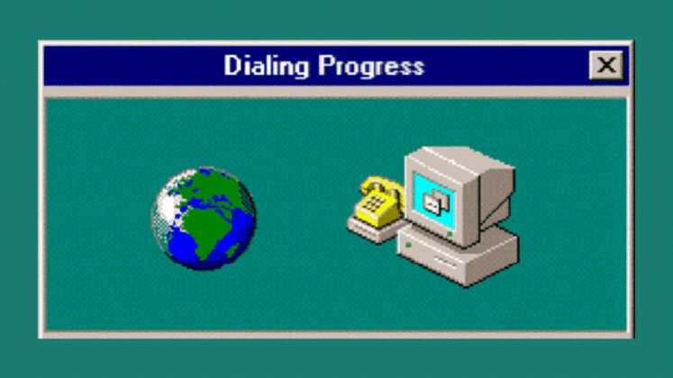

#  1990s – The Internet and Open Source Revolution

> “The power of the Web is in its universality.  
> Access by everyone, regardless of disability, is an essential aspect.”  
> — Tim Berners-Lee, 1991

---

##  Revolution

In the **1990s**, one of the greatest transformations in software history began:  
The **birth of the World Wide Web** (Tim Berners-Lee, 1991) and the **rise of open-source communities** (Linux, 1991) turned software from an exclusive product into a **global, shared resource**.  

The web connected developers across the world, while open source created a culture of **collaboration, transparency, and innovation**.  

---

##  Main points

| Event / Movement              | Significance                                                              |
| ------------------------------ | -------------------------------------------------------------------------- |
|  **World Wide Web (1991)**  | Enabled global information exchange and software distribution.            |
|  **Linux & Open Source**     | Established the foundation of freely developed community software.        |
|  **Free Distribution**       | Allowed anyone to share, modify, and improve code from anywhere.          |

Example:  
Group of students from different countries could now collaborate on the same code.

---

##  Impact

-  **Global Collaboration** – Developers began working together across borders.  
-  **Knowledge Exchange** – Early online communities and mailing lists.  
-  **Faster Innovation** – Ideas spread in days instead of years.  
-  **New Business Models** – Companies like Red Hat and Google grew from open-source roots.  

---

##  Challenges

-  **Licensing Issues** – How to protect free software from misuse?  
-  **Trust & Quality** – Who ensures the reliability of community-developed code?  
-  **Digital Divide** – Not everyone had equal access to the new digital world.  

---

##  Significance
  
For the first time, people worldwide could **create, share, and improve knowledge together** — paving the way for platforms like **GitHub**, **Wikipedia**, and **Stack Overflow**.  

---

##  Influence on Software Engineering

The 1990s reshaped how software was engineered:  

| Innovation               | Description |
| -------------------------- | ------------ |
|  **Version Control Systems** | Tools like CVS and later Git enabled distributed collaboration. |
|  **Open Development Models** | Transparent contribution and peer review improved code quality. |
|  **Agile Thinking Roots** | The idea of iterative, collaborative development began here. |

---

