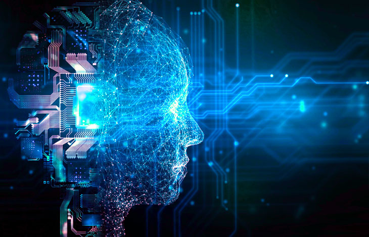

# 🤖 2032 – Autonomous Refactoring Systems

> „Code wird bald nicht mehr _geschrieben_, sondern _kuriert_.“  
> — Fiktives Zitat, 2032

---

##  Vision

Im Jahr **2032** haben sich KI-Systeme so weit entwickelt, dass sie **Legacy-Code eigenständig verstehen, bewerten und verbessern** können.  
Diese Systeme analysieren Millionen Codebasen, erkennen Muster ineffizienter Strukturen und führen **autonomes Refactoring** durch – ohne menschlichen Eingriff.

---

## Wie funktioniert das?

| Komponente                      | Beschreibung                                                                       |
| ------------------------------- | ---------------------------------------------------------------------------------- |
|  **Machine Learning Modelle** | Lernen Code-Smells und Architektur-Patterns aus riesigen Open-Source-Datenbanken   |
|  **Code Semantics Engine**    | Versteht die Bedeutung und Abhängigkeiten von Code-Strukturen                      |
|  **Refactoring Bots**         | Ersetzen ineffizienten oder unsicheren Code durch optimierte Versionen in Echtzeit |

Beispiel:  
Ein Bot erkennt redundante Klassen oder veraltete APIs in einer Java-App – und schlägt automatisch eine modernisierte Version mit weniger Abhängigkeiten vor.

---

## Vorteile

-    **Massiv reduzierte Wartungskosten**
-    **Kontinuierliche Codequalität ohne menschlichen Aufwand**
-    **Automatische Kompatibilitätsprüfungen und Regressionstests**
-    **Nachhaltige Softwareentwicklung durch weniger technische Schulden**

---

##  Herausforderungen

-    Wie definieren wir „guten“ Code, wenn Maschinen ihn ändern?
-    Welche Rolle spielt der Entwickler – Kurator oder Supervisor?
-    Vertrauen: Wie überprüft man autonom generierten Code?

---

##  Bedeutung

Dieser Meilenstein markiert den Übergang von **manueller Wartung** zu **intelligenter Code-Evolution**.  
Software wird zu einem **selbstpflegenden Ökosystem**, das seine Qualität über Jahrzehnte erhalten kann.

---

