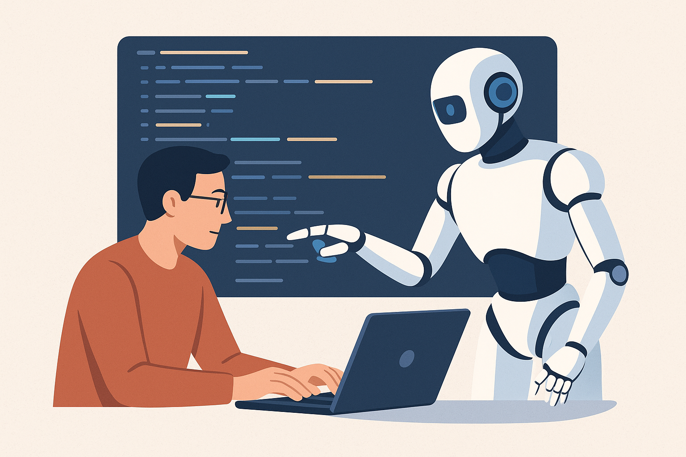

# 2040 – The Synthetic Developer

---

## Hintergrund

Bis 2040 haben KI-Systeme die Rolle des reinen Assistenten hinter sich gelassen.  
Sie **analysieren Nutzerverhalten, Fehlerprotokolle und Zielmetriken**, um daraus selbstständig **neue Funktionen und Verbesserungen** abzuleiten.  

Der klassische Zyklus *Plan → Build → Test* verschmilzt zu einem **kontinuierlichen, KI-gesteuerten Entwicklungsprozess**, bei dem Maschinen und Menschen gemeinsam Software gestalten.

---

## Wie funktioniert das?

| Komponente                      | Beschreibung |
| ------------------------------- | ------------- |
|  **Autonome Feature-Entwicklung** | KI erkennt Funktionslücken und implementiert Vorschläge direkt im Code. |
|  **Verhaltensanalyse**            | Nutzungsdaten fließen in Design- und Architekturentscheidungen ein. |
|  **Selbstoptimierende Pipelines** | Continuous Integration & Deployment werden von KI-Systemen gesteuert. |

Beispiel:  
Eine KI erkennt, dass Nutzer bestimmte Funktionen häufig kombinieren – und entwickelt automatisch ein neues Interface, das diese Abläufe vereinfacht.

---

## Bedeutung

Softwareentwicklung wird zu einem **Dialog zwischen Mensch und Maschine**:  
Entwickler*innen definieren Ziele, ethische Leitplanken und Qualitätsstandards,  
während der „Synthetic Developer“ selbstständig Wege findet, diese umzusetzen.  

So entsteht ein neues Paradigma – von dem **Werkzeug KI** zum vollwertigen **Co-Entwickler**.

---

## Fazit

Der „Synthetic Developer“ steht für den nächsten großen Sprung im Software Engineering:  
Eine Zukunft, in der **Software aktiv an ihrer eigenen Weiterentwicklung teilnimmt**,  
und die Rolle des Menschen sich von der Umsetzung hin zur **Strategie und Verantwortung** verschiebt.

---
